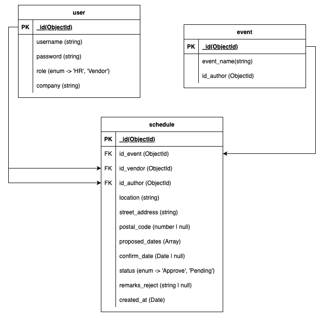

# Embreo Tech Test
By Muhamad Putra Satria

## Table of Contents

- [Requirements Test](#requirements-test)
- [How To Run Project Backend](#how-to-run-project-backend)
- [How To Run Project Frontend](#how-to-run-project-frontend)
- [API Structure](#api-structure)
- [Our Stacks](#our-stacks)

### Requirements Test

here I attach some requirements files that I have done

- [Mongodb Compass UI and Collection Screenshoot Details](https://docs.google.com/presentation/d/1-syQ0ORQw2JBri3-O-OUQqQLz9lMrKAYB_j3oIaB-y8/edit?usp=sharing)
- [Documentation API](https://documenter.getpostman.com/view/20326240/2sAXjKbYrH)
- Deploy Link
    - [Backend](https://embreo-be.vercel.app/)
    - [Frontend](https://embreo-fe.vercel.app/)

### How To Run Project Backend

- Clone Repository
  Clone repository:

  ```bash
  git clone https://github.com/mpsalunggg/embreo.git
  cd embreo
  cd backend
  ```

- Create URL Cluster on MongoDB Atlas
  Buat cluster MongoDB di [MongoDB Atlas](https://www.mongodb.com/cloud/atlas).

- Open URL MongoDB on MongoDB Compass (Optional)
- Install Dependencies

  ```bash
  yarn install
  // or
  npm install
  ```

- Add File Environment .env

  ```plaintext
  DB_CONNECTION=your_mongodb_url_cluster
  PORT=3000
  JWT_SECRET=your_jwt_secret
  ```

- Run Server Development

  ```bash
  yarn dev
  // or
  npm run dev
  ```

### How To Run Project Frontend

- Clone Repository
  Clone repository:

  ```bash
  git clone https://github.com/mpsalunggg/embreo.git
  cd embreo
  cd frontend
  ```

- Install Dependencies

  ```bash
  yarn install
  // or
  npm install
  ```

- Add File Environment .env

  ```plaintext
  NEXT_PUBLIC_BASE_URL='https://embreo-be.vercel.app/api'
  ```

- Run Server Development

  ```bash
  yarn dev
  // or
  npm run dev
  ```

### API Structure

- ERD
  
- [Documentation API](https://documenter.getpostman.com/view/20326240/2sAXjKbYrH)

```
https://documenter.getpostman.com/view/20326240/2sAXjKbYrH
```

### Our Stacks

**Frontend Stacks**

- Typescript
- Next JS
- Tanstack
- Axios
- Antd
- TailwindCSS
- Jwt Decode

**Backend Stacks**

- Typescript
- Next JS
- Tanstack
- Axios
- Antd
- TailwindCSS
- Jwt Decode
